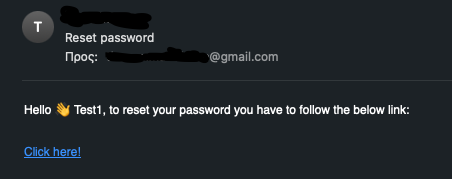

# Express.js-React-MySQL Authentication System with cookies for authentication and session management

This project is about a web application with a robust authentication system built using React for the frontend, Express.js for the backend, and MySQL as the database. User interaction with the backend is handled via cookies for authentication and session management.

## Project Structure

The application is divided into three main components:

1. **API**: Handles the backend logic and database interactions.
2. **Client**: The user-facing frontend application.
3. **Admin**: A separate administration interface for managing the application.

## Features

- 	User authentication system (login, signup, logout).
- 	Role-based access control for regular users and administrators.
- 	Secure connection to a MySQL database.
- 	Intuitive user interface built with React.
- 	Admin panel for managing users and application data.
- 	Email verification system: Sends a confirmation email upon user registration.


- 	Password reset functionality: Sends a reset link via email to users who forgot their password.




---

## Requirements

To run this project, ensure you have the following installed:

- [VSCode](https://code.visualstudio.com/) or a simiral code editor
- [Node.js](https://nodejs.org/) (v18 or later)
- [MySQL](https://www.mysql.com/) (active on your system)

---

## Setup Instructions

## 1. Activate MySQL

Before starting, ensure that your MySQL server is installed, running, and properly configured.


## 2. Create the Database
- Open your MySQL client or a database tool like MySQL Workbench, phpmyadmin etc.  
- Run the command to create a database named `ReactFullAuth`.


## 3. Set Up the Tables
- The necessary database tables are defined in the `/api/schema.sql` file.  
- Import this file into your database or execute its contents manually.

Now your MySQL database is ready for use!


## 4. Configure SMTP for Email Sending
   - To send emails (such as verification and password reset emails), you need to set up your own SMTP server.  
   - You can use **Gmail SMTP** easily with your Google account.  
   - Update your `.env` file with the following SMTP details:

     - **SMTP_HOST**: Your SMTP server (e.g., `smtp.gmail.com` for Gmail).  
     - **SMTP_PORT**: `587` for TLS, `465` for SSL, `25` for non-secure connections.  
     - **SMTP_SECURE**: Set to `true` for secure connections.  
     - **SMTP_MAIL**: Your email address (e.g., `your-email@gmail.com`).  
     - **SMTP_PASSWORD**: Your email password or an **App Password** for security.  

   - If using Gmail, enable **"Less Secure Apps"** (if necessary) or generate an **App Password** from your Google Account security settings.


## 5. Clone the Repository:
   ```bash
   git clone https://github.com/Klajdis32/Express.js-React-MySQL-Authentication-System.git
   cd <repository_folder>
   ```


## 6. Setup and Run Each Component:

   ### API
   1. Navigate to the API folder:
      ```bash
      cd api
      ```
   2. Install dependencies:
      ```bash
      npm install
      ```
   3. Start the API server:
      ```bash
      npm start
      ```

   ### Client
   1. Navigate to the Client folder:
      ```bash
      cd ../client
      ```
   2. Install dependencies:
      ```bash
      npm install
      ```
   3. Start the Client interface:
      ```bash
      npm start
      ```

   ### Admin
   1. Navigate to the Admin folder:
      ```bash
      cd ../admin
      ```
   2. Install dependencies:
      ```bash
      npm install
      ```
   3. Start the Admin interface:
      ```bash
      npm start
      ```

---

## Folder Structure

```plaintext
<project-folder>
|
├── api/            # Backend API built with Express.js
├── admin/          # Admin panel frontend
└── client/         # Client-facing frontend
```

---

## Usage

- **API**: Serves as the central hub connecting the frontend applications to the database.
- **Client**: Allows users to interact with the application (e.g., login, view content).
- **Admin**: Provides tools for administrators to manage users and data.

---

## Notes

- Ensure all necessary environment variables (e.g., database credentials, JWT secret) are set before running the application.
- The application runs on default ports (API: `http://localhost:8081`, Admin: `http://localhost:3001`, Client: `http://localhost:3000`). Adjust these if needed.
